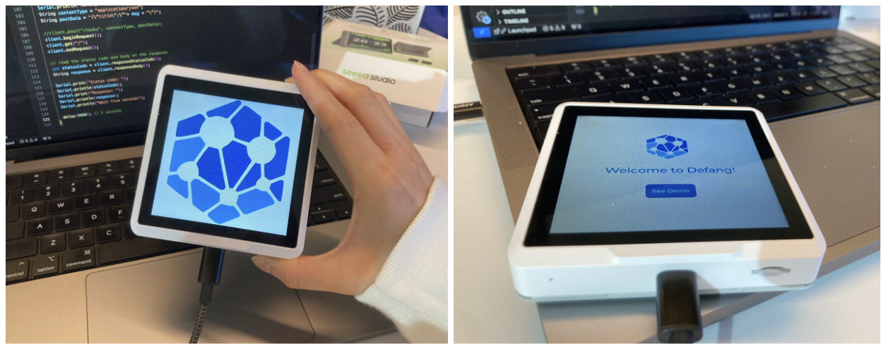

# Interactive UI for Embedded Systems Project at Defang Software Labs (Static)
*Note: This repository version is named **"static"** as there is no wifi networking involved. For the networking version of this project, please see the `/defang-arduino` repository.*

This repository contains a simple interactive UI program for a [SenseCAP Indicator Device](https://wiki.seeedstudio.com/Sensor/SenseCAP/SenseCAP_Indicator/Get_started_with_SenseCAP_Indicator/). It was programmed for an Embedded Systems project at Defang Software Labs.

The device has a square liquid-crystal touch screen display, and a ESP32-S3 chip that can be programmed in an Arduino environment.

This version of the program was created using [Squareline Studio](https://squareline.io/), a UI design tool for embedded devices.  It includes an interactive demo of the touch screen, and handles touch screen user input. There is no wifi networking involved. 

To view set up details, see `technical_setup.md`.